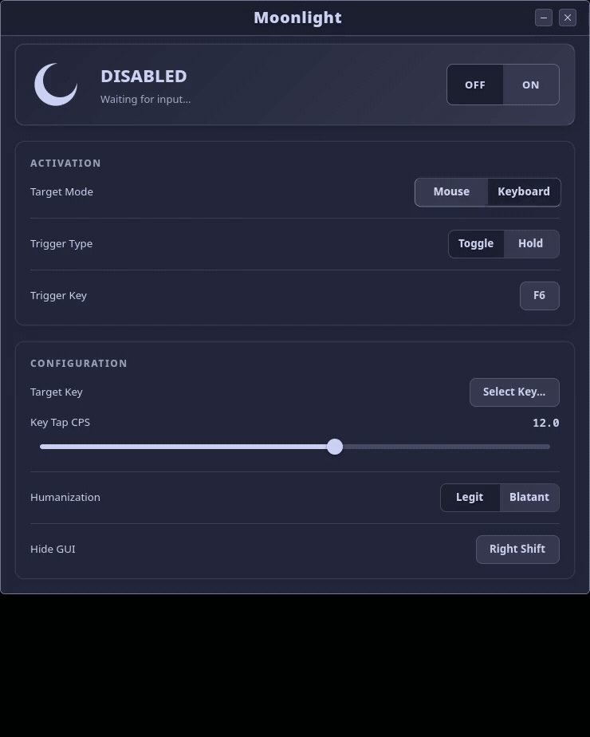

# 🌙 Moonlight

> **A modern, kernel-level auto clicker for Linux.**


-lightgrey)

I needed a proper auto-clicker for Linux that worked on Wayland without relying on ancient X11 hacks or clunky scripts. **Moonlight** is a feature-rich tool that uses the kernel's `uinput` system to create a virtual mouse device.

It **should** work out of the box on both Wayland (Hyprland, GNOME, KDE) and X11. It also features humanized timing and randomized jitter, making it perfect for both desktop automation and Minecraft PvP.

---

## 📸 Demo

<p align="center">
  
</p>

---

## 🔥 Features

* **Kernel-Level Input:** Instead of sending software signals, Moonlight creates a virtual device in `/dev/uinput`. To the OS and games, it looks identical to a real physical mouse.
* **Process Cloaking:** The background daemon actively renames itself to `kworker/u12:0` (a common kernel thread) so it blends into `htop` and task managers.
* **Biological Timing:** It doesn't just use random numbers. The engine cycles through "cruising", "burst", and "tired" states using Gaussian distribution to mimic actual human muscle fatigue and reaction speeds.
* **PvP Assist:** Built-in logic for **W-Tapping** (sprint resetting) and **Blockhitting** (animation canceling) that weaves seamlessly into the click stream.
* **Asynchronous Architecture:** The click engine runs in a completely separate process from the UI. You can drag the window around or minimize it, and the click rate will never stutter.

---

## 🚀 Installation

Moonlight comes with a smart installer that handles system dependencies, creates the necessary permissions, and adds the app to your desktop menu.

```bash
# Clone the repository
git clone https://github.com/oNxZero/Moonlight.git

# Enter the directory
cd Moonlight

# Make the installer executable
chmod +x install.sh

# Run the universal installer and wait for it to finish
./install.sh
```

**Note:** You must **REBOOT** after installing. The script creates a new hardware permission rule so you don't have to run the app as root.

---

## 📖 Usage

Once installed, simply search for **Moonlight** in your application menu.

### 🟢 The Dashboard
The interface is split into simple controls:

* **Master Switch:** The global safety. This must be **ON** for any clicks to register.
* **Trigger Mode:**
    * **Toggle:** Press key to start clicking, press again to stop.
    * **Hold:** Clicks only while you physically hold the key down.
* **Humanization:**
    * **Legit:** Adds realistic jitter and timing drift (recommended for gaming).
    * **Blatant:** Strict timing with little variance (maximum efficiency).

---

## ⌨️ Keybinds
You can rebind these directly in the app by clicking the button and pressing a new key.

| Key | Action | Description |
| :--- | :--- | :--- |
| **[F6]** | **Left Click** | Toggles the left mouse clicker. |
| **[F7]** | **Right Click** | Toggles the right mouse clicker. |
| **[R-Shift]** | **Panic Mode** | Instantly hides or shows the window. |

---

## ⚙️ Configuration

Settings are saved automatically on exit to `~/.config/Moonlight/config.json`.

You can edit this file manually if you want precise control over values not shown in the UI:

```json
{
    "cps_left": 12.0,
    "cps_right": 12.0,
    "jitter": 2.0,
    "rand": 1,
    "mode": "mouse",
    "target_btn": -1,
    "trigger_mode": "toggle",
    "trigger_left": 64,
    "trigger_right": 65,
    "hide_key": 54,
    "assist_wtap": false,
    "assist_wtap_chance": 5,
    "assist_blockhit": false,
    "assist_blockhit_chance": 10.0
}

```

---

## 📜 License

Distributed under the MIT License. See `LICENSE` for more information.
